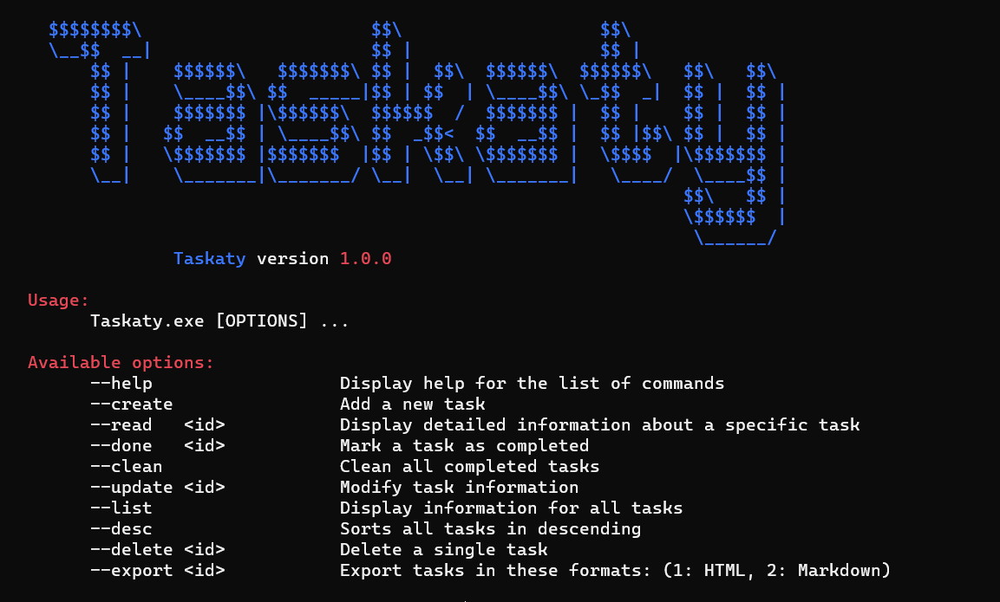

# Taskaty

Taskaty is a versatile command-line task manager that helps you keep track of your tasks efficiently.

## Installation
- Make sure that you have installed (dotnet, ef) in your machine before start the installation process.
```sh
git clone https://github.com/aigeoo/Taskaty.git
cd Taskaty
dotnet ef migrations add InitialCreate
dotnet ef database update
dotnet build
```

## Usage


## Features
- Manage tasks from the command line.
- Add, update, mark as done, and delete tasks.
- Display task lists and detailed information.
- Export tasks in HTML and Markdown formats.

## Todo
- [ ] Make CI/CD pipeline
- [ ] Make some unit test
- [ ] Provide a Task Reminder

<br>

Feel free to contribute to Taskaty by submitting pull requests or creating issues in the [Github repository](https://github.com/aigeoo/Taskaty).
